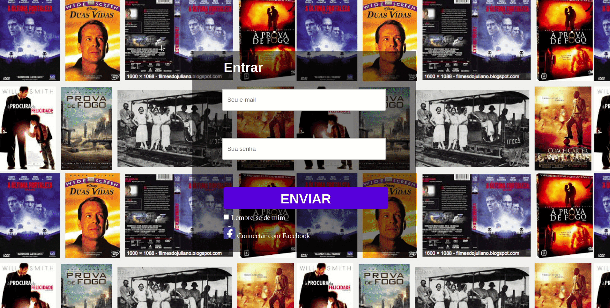

# clone_netflix
Recriando a interface do Neflix, com uma personalizando em relação a plataforma original.
Renomeada como "Coach Flix", a proposta é apresentar filmes que tragam algum tipo de lição de vida e comportamento.

## Tecnologias utilizadas:
+ HTML5
+ CSS3
+ JavaScript
+ Jquery plugin Owl Carousel

### Trabalhado responsividade com  media querys, uso de Jquery para a criação do carrossel, animação js para o texto e eventos js para a pagina de login. Com HTML, foi trabalhado a distribuição dos elementos com flexbox.

